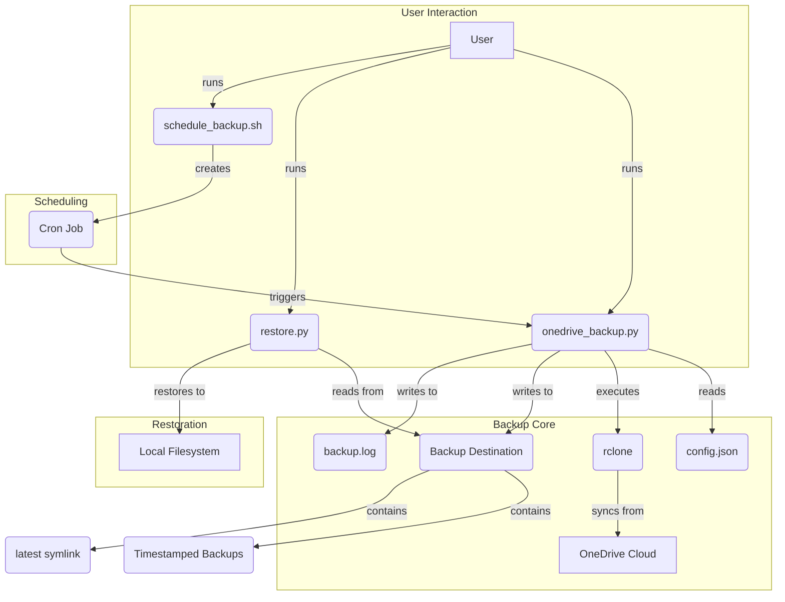

# Architecture Overview

This document provides a high-level overview of the architecture of the OneDrive Backup Tool.

## 1. High-Level Overview

The OneDrive Backup Tool is a command-line application designed to back up files from a Microsoft OneDrive account to a local machine. Its architecture is based on a collection of Python scripts and shell scripts that work together to provide a robust and configurable backup solution.

The core of the tool is the `rclone` command-line utility, which handles the communication with the OneDrive API. The Python scripts act as a wrapper around `rclone`, adding features like version management, logging, and easy restoration.

## 2. Core Components

The tool consists of the following core components:

### `rclone`

`rclone` is a powerful command-line program to manage files on cloud storage. In this project, it is used to:

*   Connect to the user's OneDrive account.
*   Sync files from OneDrive to the local backup directory.
*   List files and directories in OneDrive.

### `onedrive_backup.py`

This is the main Python script responsible for orchestrating the backup process. Its key responsibilities include:

*   **Configuration Management:** Loading backup settings from `config.json`.
*   **Dependency Checking:** Ensuring that `rclone` and other required tools are installed.
*   **Backup Execution:**
    *   Creating a timestamped directory for the new backup.
    *   Executing the `rclone sync` command to download files.
    *   Handling errors and logging the output.
*   **Version Management:** Deleting old backups based on the `keep_versions` setting.
*   **Symlinking:** Creating a `latest` symbolic link to the most recent backup.

### `restore.py`

This Python script provides the functionality to restore files from a backup. Its features include:

*   Listing available backups.
*   Restoring the entire backup to a specified directory.
*   Restoring specific files or folders.
*   Searching for files within the backups.

### `config.json`

This JSON file stores the configuration for the backup tool. It allows users to customize:

*   The backup destination directory.
*   The number of backup versions to keep.
*   File and folder exclusion patterns.
*   `rclone` and `rsync` command-line options.

### Shell Scripts (`.sh`)

A collection of shell scripts provide helper functionalities:

*   **`setup.sh`:** Automates the initial setup process, including dependency installation.
*   **`configure_onedrive.sh`:** A guided script to help users configure `rclone` for OneDrive access.
*   **`schedule_backup.sh`:** Simplifies the process of creating a `cron` job for automatic backups.
*   **`backup_no_sleep.sh`:** Prevents the system from sleeping during a backup.
*   **`check_power.sh`:** Checks the system's power and sleep settings.

## 3. Data Flow

### Backup Process

1.  The user initiates a backup by running `onedrive_backup.py` or through a scheduled `cron` job.
2.  The script reads the configuration from `config.json`.
3.  It creates a new timestamped directory in the backup destination.
4.  It calls `rclone sync` to copy files from the OneDrive remote to the newly created directory.
5.  After a successful sync, the script deletes the oldest backup directories to enforce the `keep_versions` policy.
6.  Finally, it updates the `latest` symlink to point to the new backup.

### Restore Process

1.  The user runs `restore.py` with the desired options (e.g., list backups, restore specific files).
2.  The script reads the available backups from the backup destination directory.
3.  It uses `rsync` or `cp` to copy the requested files from the selected backup to the restore destination.

## 4. Directory Structure

The backup destination directory has the following structure:

```
/path/to/backup_destination/
├── backup_20250123_143000/
│   ├── Documents/
│   └── Pictures/
├── backup_20250122_143000/
├── backup_20250121_143000/
├── latest -> backup_20250123_143000  (symlink)
└── backup.log
```

*   Each `backup_YYYYMMDD_HHMMSS` directory is a full snapshot of the OneDrive account at that time.
*   The `latest` symlink always points to the most recent backup.
*   `backup.log` contains the logs of all backup operations.

## 5. Architecture Diagram


